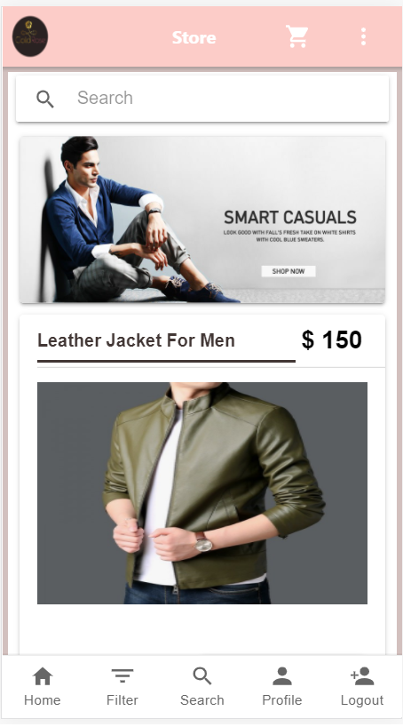
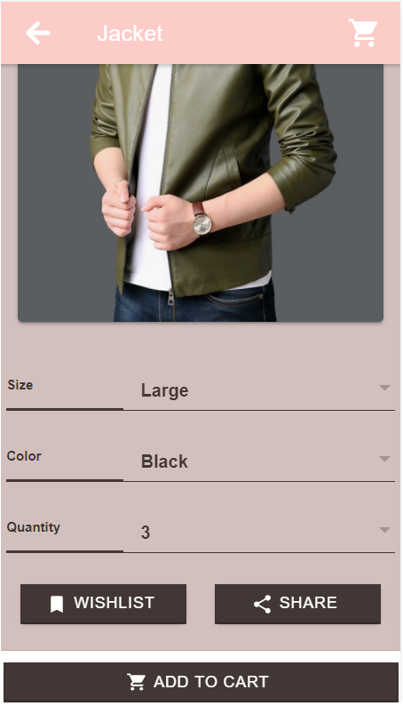
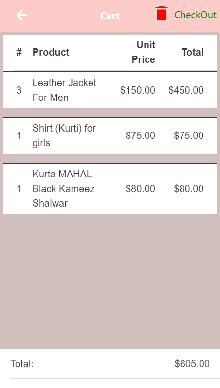
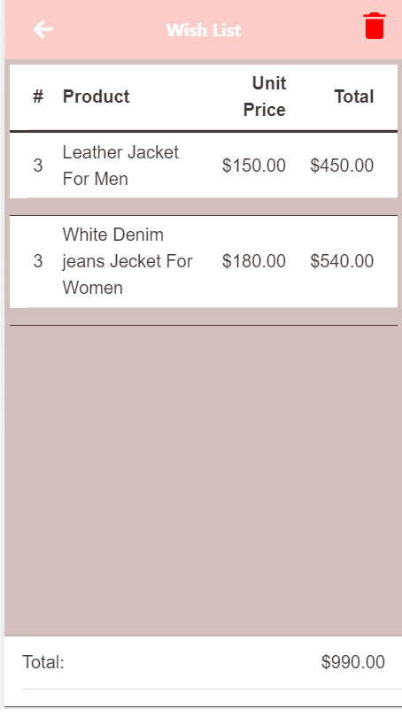
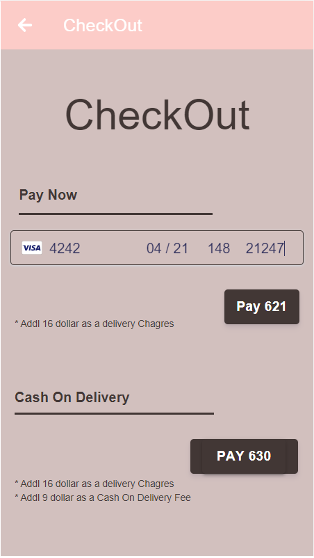
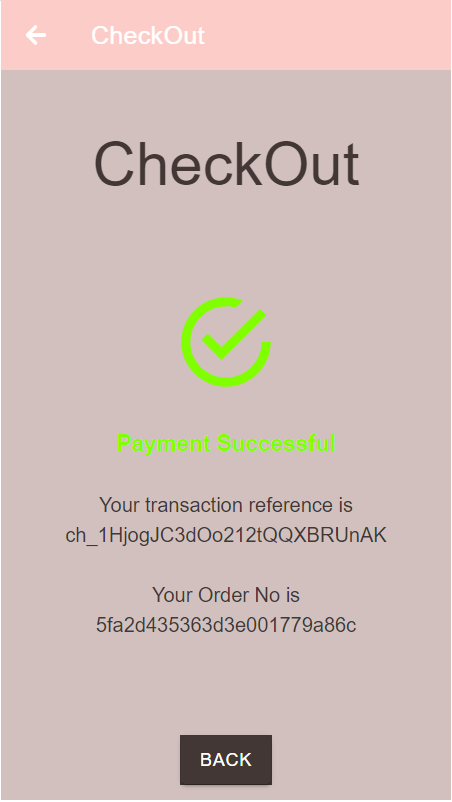
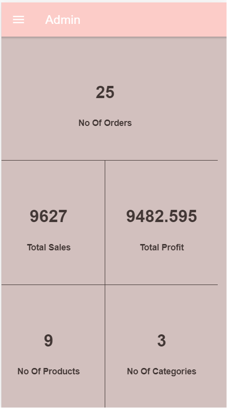

# gold-rose-ionic-frontend

# E-Commerce (Gold-Rose) Ionic App

This is an eCommerce app, it consist of 3 panels

1. Admin Panel
2. Seller Panel
3. Buyer Panel

## Getting Started

### Installing

```
git clone https://github.com/arslanfareed/goldrose.git
```

### **Instruction for using Admin Panel**

**Admin Panel:** This Panel is used to track buyer, seller, orders and Inventory. Only admin has right to access this panel. To access Admin Panel use below credentials.

### **Images**

<hr />

<div>

<span style="float:left; width:25%; margin:4%">
<h3>Store Front</h3>

</span>
<br />

<span>
<h3>Product Detail</h3>

</span>
<br />

<span>
<h3>Cart</h3>

</span>
<br />

<span>
<h3>Wish List</h3>

</span>
<br />

<span>
<h3>Payment Gateway</h3>

</span>
<br />

<span>
<h3>Confirmation Screen</h3>

</span>
<br />

<span style="float:left; width:25%; margin:4%">
<h3>Dashboard</h3>


</span>
<br />
<br />

### **Credentials**

<hr />

**Admin Panel:**<br>
**E-Mail:** admin_1@gmail.com<br>
**Password:** password123<br>

**User Panel:**<br>
**E-Mail:** arslan_fareed05@live.com <br>
**Password:** password123<br>

**Store Panel:**<br>
**E-Mail:** company2@gmail.com <br>
**Password:** password123<br>

**Sandbox Card Detail:**<br>
**Card No:** 4242 4242 4242 4242<br>
**Pin:** 123<br>

</div>

## Authors

- **Arslan Fareed**
